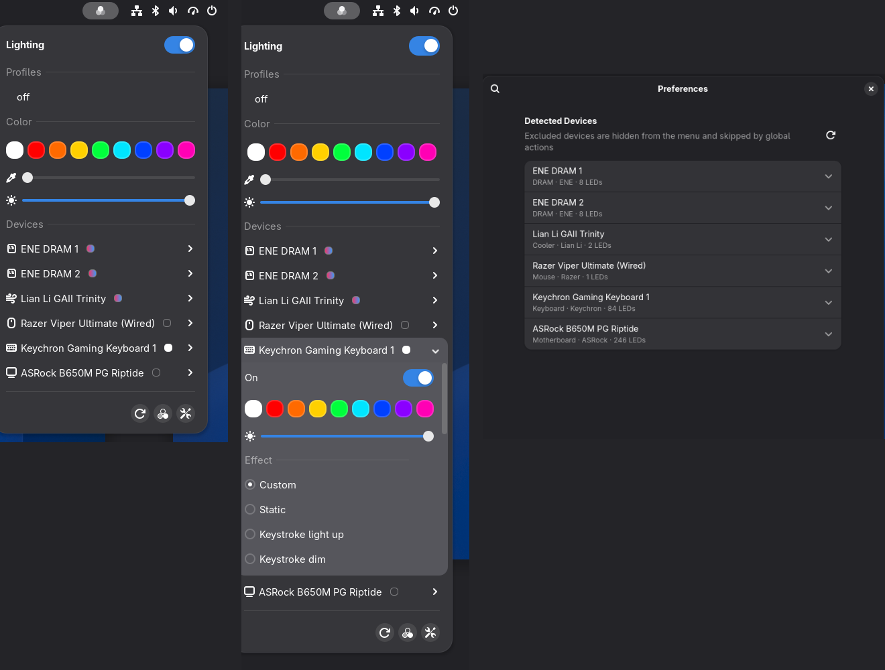

# RGB Lighting



Control your RGB hardware from the GNOME top bar. RGB Lighting connects directly to [OpenRGB](https://openrgb.org)'s SDK server, so every change happens instantly. It covers motherboards, RAM, coolers, keyboards, mice, GPUs and anything else OpenRGB supports. Your OpenRGB **profiles** are one click away.

## Features

- **Top bar menu**, or a **Quick Settings tile** if you prefer:
  - **Lighting** switch that turns everything on or off.
  - **Profiles:** your OpenRGB profiles; click one to load it. The active one is checked.
  - **Color swatches**, a **hue slider** and a **brightness slider** that apply to all devices.
  - **Devices:** each one shows a status dot and has a submenu with an on/off switch, colors, brightness, speed, and its full effect list.
  - Buttons to rescan devices, open OpenRGB, and open Settings.
- **Handles each device's quirks:**
  - A color applied to a device keeps its current effect if the effect accepts colors. Otherwise the device switches to *Static*, and if that isn't available, to *Direct* or *Custom*.
  - "Off" uses the device's own *Off* mode, or sets it to black if it has none.
  - Brightness uses the hardware setting where one exists and scales the colors otherwise.
- **Restores the previous state:** when you switch lighting back on, each device returns to exactly what it was showing. You can load a chosen profile instead.
- **Automation:** turn lighting off while the screen is locked and/or during suspend, and restore it afterwards. You can also apply a profile once at login.
- **Keyboard shortcuts**, customizable in Settings:

  | Shortcut | Action |
  |---|---|
  | <kbd>Super</kbd>+<kbd>Shift</kbd>+<kbd>L</kbd> | Toggle lighting |
  | <kbd>Super</kbd>+<kbd>Shift</kbd>+<kbd>.</kbd> | Next profile |

- **Scroll over the top bar icon** to change brightness.
- **Settings window:**
  - Choose which profile the switch and login use.
  - Show or hide, apply, save and delete profiles.
  - Rename devices or leave them out.
  - Edit the color swatches.
  - Connection options, and whether the server starts at login.

## Requirements

- GNOME Shell **50**
- [OpenRGB](https://openrgb.org) **1.0** (SDK protocol 6). Older servers down to protocol 3 are supported on a best-effort basis.
- OpenRGB must be able to reach your devices as your user. That means its udev rules and, for RAM and motherboard lighting, `i2c` access. Check that `openrgb --list-devices` shows your hardware.

## Installation

```bash
git clone https://github.com/fqazzazee/gnome-openrgb-control.git
cd gnome-openrgb-control
./install.sh
```

Then **log out and back in**. On Wayland, GNOME Shell only picks up new extensions at login.

`install.sh` also installs and starts `openrgb-server.service`, a systemd user service that runs `openrgb --server --startminimized` at login. The GUI stays in the tray because headless `--server` does not load plugins, so effects saved in profiles (e.g. the Effects plugin) would not start. Pass `--no-service` if you already run an OpenRGB server, for example the OpenRGB GUI with its SDK server enabled.

<details>
<summary>Manual installation</summary>

```bash
cp -r openrgb-control@tesla.local ~/.local/share/gnome-shell/extensions/
glib-compile-schemas ~/.local/share/gnome-shell/extensions/openrgb-control@tesla.local/schemas
cp systemd/openrgb-server.service ~/.config/systemd/user/
systemctl --user enable --now openrgb-server.service
# log out and back in, then:
gnome-extensions enable openrgb-control@tesla.local
```
</details>

## How it works

- The extension talks directly to the OpenRGB SDK server on `127.0.0.1:6742` over a single persistent connection. It has its own implementation of the SDK's binary protocol (`lib/protocol.js`, `lib/client.js`). There are no helper processes, and it doesn't call the `openrgb` CLI, which takes seconds per call.
- OpenRGB pushes device and profile changes to the extension. Changes made in the OpenRGB GUI or by other clients therefore show up in the menu right away.
- If the server isn't reachable, the extension starts `openrgb-server.service` (or `openrgb --server` as a fallback) and keeps reconnecting.
- Profiles are the ones OpenRGB stores in `~/.config/OpenRGB/profiles`.

## Limitations

- **The extension never saves to device memory.** Your hardware returns to its stored lighting after a power cycle unless OpenRGB or a profile sets it again.
- **Loading an "on" or "off" profile affects every device in it**, including devices you've excluded in Settings.
- **The OpenRGB GUI and the server both want the hardware.** Run the GUI as a client of the server, which it does automatically when the server is already running, rather than as a second standalone instance.

## Uninstall

```bash
gnome-extensions uninstall openrgb-control@tesla.local
systemctl --user disable --now openrgb-server.service
rm ~/.config/systemd/user/openrgb-server.service
```

## License

[GPL-2.0-or-later](LICENSE)
